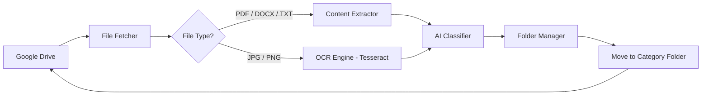

# 🧠 Drive Organizer AI

> **Automatically categorize and organize your Google Drive files using on-device AI — no manual sorting, no cloud APIs, no privacy trade-offs.**

Say goodbye to digital clutter. This tool scans your Google Drive, extracts text from **PDFs, Docs, Sheets, Images (via OCR)**, and intelligently moves files into categories like:  
**HR • Finance • Academics • Projects • Marketing • Personal**

All processing happens **locally** — your data never leaves your machine.

---

## 🏗️ System Architecture

## Project Structure 

drive-organizer-ai/
├── src/                   # Core application code
│   ├── main.py            # Entry point
│   ├── auth.py            # Google OAuth
│   ├── file_extractor.py  # Multi-format text extraction
│   ├── classifier.py      # AI classification logic
│   └── drive_manager.py   # Folder & file operations
├── assets/
│   └── category_keywords.json  # Customizable rules
├── credentials/           # (Not committed) Google OAuth file
├── requirements.txt       # Dependencies
└── README.md

## Quick Start
1. **Set up Google Cloud Project**
- Go to Google Cloud Console
- Create a new project and name it (e.g., AI-project)
- Enable Google Drive API
- Under Credentials, create an OAuth Client ID → Application type: Desktop
- Download JSON → save as credentials/credentials.json 
⚠️ Never commit credentials.json! It’s excluded via .gitignore.

2. **Install & Run (macOS/Linux)**
git clone https://github.com/your-username/drive-organizer-ai.git
cd drive-organizer-ai

python3 -m venv venv
source venv/bin/activate
pip install -r requirements.txt

python -m src.main

✅ On first run, your browser will open for Google login.
✅ After authorization, files are scanned and auto-sorted.

3. **Privacy and Security**
- 🔐 Zero external data transfer: All NLP runs locally.
- 🔑 Minimal permissions: Only requests full Drive access (required to move files).
- 🗃️ Local token storage: token.pickle stays on your device.
- 📜 Open-source transparency: Full auditability of logic.